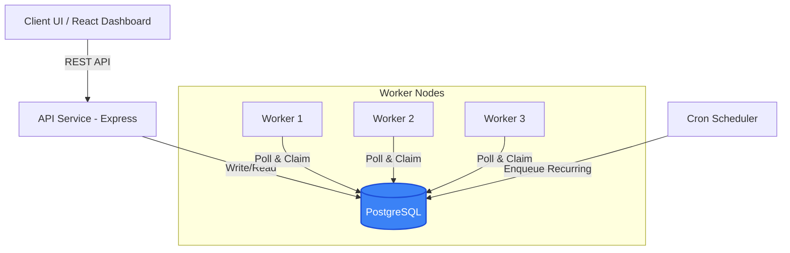
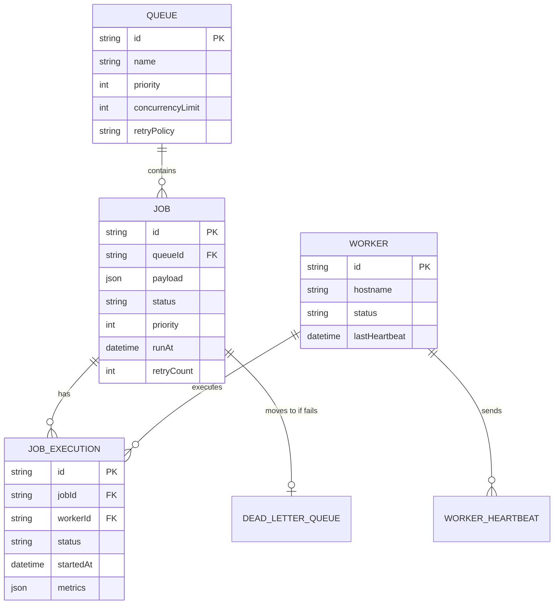

# Distributed Job Scheduler - System Design & Architecture

## Executive Summary
This document outlines the architecture, database schema, and design decisions for a production-grade Distributed Job Scheduler. The system consists of a RESTful Node.js API, decoupled worker nodes, a PostgreSQL database, and a React-based frontend dashboard. 

> [!IMPORTANT]
> **Source Code Repository**
> The complete implementation of this system is hosted on GitHub. Please review the codebase to see the exact implementation details, tests, and commit history.
> **GitHub Repository:** [Insert Your GitHub Repo Link Here]

---

## Architecture Diagram

The system employs a clean, modular architecture. The REST API handles client requests (enqueuing jobs, managing queues), while the decoupled Worker Service instances run independently, polling the database to process jobs concurrently.



---

## Entity Relationship (ER) Diagram

The database schema is highly normalized. We rely on PostgreSQL's robust concurrency controls rather than introducing an external dependency like Redis for job state.



---

## Key Design Decisions

### 1. Atomic Job Claiming (No Race Conditions)
A core challenge in distributed schedulers is ensuring that multiple workers do not pick up the same job simultaneously. Instead of adding Redis (which increases infrastructure complexity), we utilize PostgreSQL's `FOR UPDATE SKIP LOCKED`.

**Implementation:**
```sql
WITH next_job AS (
  SELECT id FROM "Job"
  WHERE status = 'QUEUED'
  ORDER BY priority DESC, "createdAt" ASC
  LIMIT 1
  FOR UPDATE SKIP LOCKED
)
UPDATE "Job" SET status = 'CLAIMED', "workerId" = $1
FROM next_job WHERE "Job".id = next_job.id
RETURNING *;
```
This query atomically locks the row, updates it, and returns the claimed job in a single database round-trip, guaranteeing idempotency and preventing deadlocks.

### 2. Decoupled Worker Nodes
The `Worker` service runs as a completely separate process from the Express API. This allows horizontal scaling. You can spin up 100 worker containers without affecting the performance of the API layer serving the frontend dashboard. 

### 3. Retry Policies & Exponential Backoff
Jobs support configurable retry policies: `FIXED`, `LINEAR`, and `EXPONENTIAL`. If a job fails, the worker calculates the `nextRunAt` timestamp based on the policy and retry count, changes the state to `SCHEDULED`, and releases the lock. 

### 4. Dead Worker Detection (Heartbeats)
Workers send a heartbeat payload to the `WorkerHeartbeat` table every 15 seconds. If a worker process crashes, its claimed jobs would theoretically remain stuck in `RUNNING`. A janitor process can identify dead workers (no heartbeat for >60s) and requeue their stalled jobs.

---

## Getting Started (Local Development)

The entire stack is containerized using Docker Compose.

```bash
# Start the PostgreSQL DB, API Server, Worker, and Frontend
docker-compose up -d

# View live logs
docker-compose logs -f
```

- **Frontend Dashboard:** `http://localhost:5173`
- **Backend API:** `http://localhost:5000`

---

## API Documentation Highlights

### `POST /api/jobs`
Enqueues a new job into a specific queue.
**Payload:**
```json
{
  "queueId": "uuid-here",
  "payload": { "email": "user@example.com", "template": "welcome" },
  "priority": 10,
  "runAt": "2026-07-03T18:00:00Z"
}
```

### `GET /api/queues/:id`
Retrieves queue details and pending job counts.

---

## Conclusion
This architecture provides a highly reliable, scalable, and observable distributed job scheduling system, leveraging the powerful concurrency controls of modern PostgreSQL to maintain strict data integrity across multiple processing nodes.
